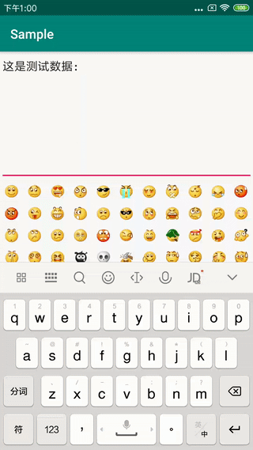

# Emoji

[](https://jitpack.io/#ShortStickBoy/Emoji)
[](http://www.apache.org/licenses/LICENSE-2.0.html)

A simple and efficient Emoji input box, you can customize Emoji expressions as needed.

### ScreenShot


### Gradle

To get a Git project into your build:

**Step 1**. Add the JitPack repository to your build file

```groovy
allprojects {
    repositories {
        ...
        maven { url 'https://jitpack.io' }
    }
}
```

**Step 2**. Add the dependency

```groovy
dependencies {
    implementation 'com.github.ShortStickBoy:Emoji:1.0.0'
}
```

### Use

**Step 1**. Add the EmojiEditText to your layout file

```xml
<com.sunzn.emoji.library.EmojiEditText
    android:id="@+id/etv"
    android:layout_width="match_parent"
    android:layout_height="200dp"
    android:gravity="start"
    app:etv_icon_size="60" />
```

**Step 2**. Insert EmojiBean to EmojiEditText

```java
EmojiEditText mEditText = findViewById(R.id.etv);
EmojiBean bean = mAdapter.getItem(position);
mEditText.insert(bean);
```

**Step 3**. Get EmojiEditText value

```java
String value = mEditText.getText().toString();
```

### Attribute

| Attribute     | Describe      | Additional                                                         |
| ------------- | ------------- | ------------------------------------------------------------------ |
| etv_icon_size | Size of emoji | If you don't set this value, it will use getTextSize() by default. |

### License
```
Copyright [2018-2019] sunzn

Licensed under the Apache License, Version 2.0 (the "License");
you may not use this file except in compliance with the License.
You may obtain a copy of the License at

   http://www.apache.org/licenses/LICENSE-2.0

Unless required by applicable law or agreed to in writing, software
distributed under the License is distributed on an "AS IS" BASIS,
WITHOUT WARRANTIES OR CONDITIONS OF ANY KIND, either express or implied.
See the License for the specific language governing permissions and
limitations under the License.
```